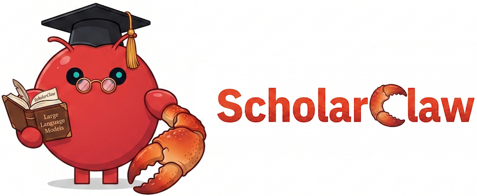

**Türkçe** / [English](README.md)

# ScholarClaw

Kanıta dayalı, öneri-öncelikli araştırma.

> Bugün terminal odaklı. Uçtan uca tam özellikli web arayüzü yakında geliyor.

ScholarClaw, sadece daha hızlı çıktı değil, daha güçlü araştırma muhakemesi isteyenler için tasarlanmış bir araştırma sistemidir.

Bitmiş makaleyi üretmeye çalışmadan önce fikri sınayan farklı bir iş akışı için geliştirilmiştir.

Prompttan çıktıya aceleyle gitmek yerine ScholarClaw ilgili çalışmaları inceler, yeniliği sorgular, zayıf noktaları ortaya çıkarır ve ham fikirleri daha güçlü, daha savunulabilir önerilere ve makalelere dönüştürmeye yardımcı olur.

## Ne Yapar

ScholarClaw araştırmacılara şunlarda yardımcı olur:

- alan için gerçekten önemli olan literatürü taramak
- bir fikrin yeni mi, kalabalık bir alanda mı, yoksa halen belirsiz mi olduğunu görmek
- uygulamaya geçmeden önce önerileri güçlendirmek
- çalışmayı en baştan itibaren kanıta dayalı tutmak
- temel sağlam olduğunda süreci yürütme, inceleme, revizyon ve yayına kadar taşımak

## Temel Yetenekler

- öneri, yürütme, yayın, değerlendirme ve revizyonu kapsayan 29 aşamalı araştırma hattı
- OpenAlex öncelikli API erişimi; Semantic Scholar ve arXiv desteği; ayrıca akademik sitelerde etmen tabanlı tarayıcı erişimi
- daha kontrollü literatür taraması için yıl penceresi ve derinlik kontrolleri
- yenilik kontrolü, atıf doğrulama ve atıf alaka budama
- yayın farkındalığı olan yazım davranışı, takılabilir yayın aileleri ve özel LaTeX şablon yolu desteği
- editör sentezi ve yapılandırılmış revizyon planlaması içeren paralel hakem iş akışları
- aşama bazlı model yönlendirme, checkpoint/resume desteği ve yerel model dostu çalışma
- benchmark odaklı deney planlama ile şekil planlama/grafik üretim yolları

## Tam Özellik Karşılaştırması

Karşılaştırma, `https://github.com/aiming-lab/AutoResearchClaw` adresindeki güncel yukarı akış `AutoResearchClaw` kamuya açık özellik yüzeyine göre hazırlanmıştır. `✓` işareti, ilgili özelliğin orada birinci sınıf ve dokümante edilmiş olduğunu; `✗` işareti ise şu an orada benzer şekilde birinci sınıf bir özellik olarak sunulmadığını gösterir. ScholarClaw’ın en büyük farklarından biri, etmen tabanlı tarayıcı erişimini literatür toplamanın birinci sınıf bir yolu olarak öne çıkarmasıdır.


| Özellik                                           | ScholarClaw | AutoResearchClaw | Notlar                                                                                                                                                                                                                       |
| ------------------------------------------------- | ----------- | ---------------- | ---------------------------------------------------------------------------------------------------------------------------------------------------------------------------------------------------------------------------- |
| Aşamalı araştırma hattı                           | ✓           | ✓                | ScholarClaw şu anda 29 aşamalı bir hat kullanır; AutoResearchClaw ise 23 aşamalı bir hattı dokümante eder.                                                                                                                   |
| Akademik sitelerde etmen tabanlı tarayıcı erişimi | ✓           | ✓                | **ScholarClaw’ın temel vurgusu:** her iki proje de tarayıcı tabanlı toplama destekler; ancak ScholarClaw kaynak farkındalığı olan tarayıcı erişimini yan bir seçenekten ziyade birinci sınıf literatür yolu olarak ele alır. |
| Kovalara ayrılmış yürütme                         | ✓           | ✗                | ScholarClaw `proposal`, `execution`, `publication`, `review` ve `revision` kovalarını doğrudan çalıştırma kapsamı olarak sunar.                                                                                              |
| Ayrı dış değerlendirme kovası                     | ✓           | ✗                | ScholarClaw dış değerlendirmeyi yayın sonrası ayrı bir akış olarak ayırır.                                                                                                                                                   |
| Ayrı dış revizyon kovası                          | ✓           | ✗                | ScholarClaw dış revizyonu yayın akışına gömmek yerine ayrı bir takip iş akışı olarak ayırır.                                                                                                                                 |
| OpenAlex / Semantic Scholar / arXiv erişimi       | ✓           | ✓                | Her iki proje de OpenAlex, Semantic Scholar ve arXiv merkezli gerçek çok kaynaklı literatür erişimi kullanır.                                                                                                                |
| Headless tarayıcı erişim modu                     | ✓           | ✗                | ScholarClaw literatür arama akışları için görünür veya headless tarayıcı otomasyonunu destekler.                                                                                                                             |
| Açık tarayıcı hedef kayıt defteri                 | ✓           | ✗                | ScholarClaw Semantic Scholar, arXiv, Elsevier / ScienceDirect, Springer, IEEE Xplore, Google Scholar ve Web of Science için birinci sınıf tarayıcı hedefleri sunar.                                                          |
| Yıl penceresi kontrolleri                         | ✓           | ✗                | ScholarClaw yakın yıllar için hazır seçenekler ve açık `start_year` / `end_year` sınırları destekler.                                                                                                                        |
| Erişim derinliği kontrolleri                      | ✓           | ✗                | ScholarClaw `fast`, `standard`, `deep` ve `exhaustive` erişim politikalarını destekler.                                                                                                                                      |
| Arama sertleştirme ve tekilleştirme               | ✓           | ✓                | Her iki proje de arama davranışını güçlendirir ve literatür sonuçlarını tekilleştirir.                                                                                                                                       |
| Öneri / hedef temellendirme                       | ✓           | ✗                | ScholarClaw erken öneri artefaktlarını toplanmış ve doğrulanmış kanıtla açık biçimde temellendirir.                                                                                                                          |
| Çoklu eleme modları                               | ✓           | ✗                | ScholarClaw `deterministic`, `llm` ve `hybrid` literatür eleme modlarını sunar.                                                                                                                                              |
| Yenilik ve konumlandırma kontrolleri              | ✓           | ✗                | ScholarClaw iş akışında yenilik ve konumlandırma desteğini açık şekilde öne çıkarır.                                                                                                                                         |
| Atıf doğrulama                                    | ✓           | ✓                | Her iki proje de ham üretime güvenmek yerine çok katmanlı atıf doğrulaması yapar.                                                                                                                                            |
| Atıf alaka budama                                 | ✓           | ✓                | Her iki proje de alakaya dayalı atıf temizliği içerir.                                                                                                                                                                       |
| Yayın farkındalığı olan yazım                     | ✓           | ✓                | AutoResearchClaw konferans odaklı yazıma ağırlık verir; ScholarClaw bunu yayın ailesi farkındalığına doğru genişletir.                                                                                                       |
| Özel LaTeX şablon yolu                            | ✓           | ✗                | ScholarClaw şablon seçiminin yanında kullanıcı tarafından verilen bir LaTeX şablon yoluna da izin verir.                                                                                                                     |
| BenchmarkAgent                                    | ✓           | ✓                | Her iki proje de benchmark odaklı deney desteği içerir.                                                                                                                                                                      |
| FigureAgent                                       | ✓           | ✓                | Her iki proje de şekil/grafik üretim yolları içerir.                                                                                                                                                                         |
| Paralel hakem iş akışları                         | ✓           | ✓                | Her iki proje de çok etmenli değerlendirme destekler.                                                                                                                                                                        |
| Devam edilebilir hakem manifestleri               | ✓           | ✗                | ScholarClaw tamamlanan hakem çıktıları ve manifestleri saklayarak yeniden kullanılmasını sağlar.                                                                                                                             |
| Yapılandırılmış revizyon planlama                 | ✓           | ✗                | ScholarClaw revizyon planlarını doğrudan editör ve hakem çıktılarından kurar.                                                                                                                                                |
| Aşama bazlı model yönlendirme                     | ✓           | ✗                | ScholarClaw farklı aşama gruplarına YAML üzerinden farklı model seçimleri atanmasına izin verir.                                                                                                                             |
| LM Studio / Ollama dostu yerel çalışma yolu       | ✓           | ✗                | ScholarClaw yerel OpenAI-uyumlu çalışma biçimini LM Studio ve Ollama benzeri kurulumlarla açıkça dokümante eder.                                                                                                             |
| ACP uyumlu yürütme                                | ✓           | ✓                | Her iki proje de ACP uyumlu yürütme yollarını sunar.                                                                                                                                                                         |
| Checkpoint ve devam etme                          | ✓           | ✓                | Her iki proje de uzun çalışmaları kaldığı yerden sürdürmeyi destekler.                                                                                                                                                       |
| Kalıcı alt-aşama kurtarma                         | ✓           | ✗                | AutoResearchClaw onarım döngülerine ve checkpoint odaklı HITL modlarına sahiptir; ScholarClaw ise ayrıca daha ince alt-aşama durumlarını ve değerlendirme artefaktlarını kalıcı hale getirir.                                |
| `validate` / `doctor` / `report` komutları        | ✓           | ✗                | ScholarClaw açık yapılandırma doğrulama, ortam sağlık kontrolü ve koşu raporu üretimi sunar.                                                                                                                                 |
| Tek aşama ve kova kapsamlı yürütme                | ✓           | ✗                | ScholarClaw tam aşama çalıştırma ve kova kapsamlı çalıştırmayı birinci sınıf CLI kontrolü olarak sunar.                                                                                                                      |
| Koşular arası öğrenme                             | ✓           | ✓                | ScholarClaw `EvolutionStore` kullanır; AutoResearchClaw ise MetaClaw entegrasyonunu dokümante eder.                                                                                                                          |
| HITL yardımcı pilot modları                       | ✗           | ✓                | AutoResearchClaw `co-pilot`, `checkpoint`, `step-by-step` ve aşama politikaları gibi daha zengin HITL modlarını dokümante eder.                                                                                              |
| OpenClaw / mesajlaşma platformu entegrasyonu      | ✗           | ✓                | AutoResearchClaw OpenClaw ve mesajlaşma platformu entegrasyonunu açıkça dokümante eder.                                                                                                                                      |


## İş Akışı Felsefesi

ScholarClaw, bir araştırma yönüne bağlanmadan önce daha net düşünmek isteyen araştırmacılar içindir.

Erken fikir aşamasından öneriye, yürütmeden yayına kadar odak sadece hız değildir.

Odak, araştırma muhakemesini daha erkene çekmektir.

## Hızlı Başlangıç

### 1. Bir Python ortamı oluşturun

ScholarClaw Python 3.11 veya daha yenisini gerektirir.

```bash
python3 -m venv .venv
source .venv/bin/activate
python -m pip install --upgrade pip
```

### 2. ScholarClaw'ı kurun

Standart API odaklı yol için:

```bash
pip install -e .
```

Tarayıcı tabanlı literatür erişimini de istiyorsanız:

```bash
pip install -e ".[browser]"
playwright install
```

### 3. Örnek yapılandırmadan başlayın

Örnek yapılandırma sandbox çalıştırıcısını zaten `.venv/bin/python3` yoluna işaret edecek şekilde ayarlanmıştır; bu nedenle `.venv` kullanmak kurulumu kolaylaştırır.

```bash
cp config.local.yaml config.yaml
```

Ardından `config.yaml` dosyasını düzenleyin ve kullanmak istediğiniz LLM arka ucunu seçin:

- barındırılan OpenRouter modelleri için `openrouter`
- yerel LM Studio OpenAI-uyumlu sunucusu için `lmstudio`
- başka bir uyumlu uç nokta için `openai-compatible`
- ACP etmen yürütmesi için `acp`

En azından LLM bölümünün ve ortamınız için gerekli API anahtarı değişkenlerinin doğru ayarlandığından emin olun.

### 4. Yapılandırmayı doğrulayın

```bash
scholarclaw validate -c config.yaml
```

### 5. Hattı inceleyin

```bash
scholarclaw list-stages
scholarclaw list-stages --bucket proposal
```

### 6. İlk konunuzu çalıştırın

```bash
scholarclaw run -c config.yaml --topic "Grounded proposal generation for autonomous scientific research"
```

### 7. Sonraki faydalı komutlar

```bash
scholarclaw doctor -c config.yaml
scholarclaw report runs/<your-run-dir>
```

İş akışının sadece bir bölümünü çalıştırmak istiyorsanız, yürütmeyi kova veya tam aşama bazında sınırlandırabilirsiniz:

```bash
scholarclaw run -c config.yaml --bucket proposal
scholarclaw run -c config.yaml --only-stage SEARCH_STRATEGY
```

## Neden Var

Çok fazla araştırma iş akışı fikirden doğrudan çıktıya atlıyor.
Hızlı özetliyor, kendinden emin biçimde üretiyor ve temel sorular test edilmeden yoluna devam ediyor:

- Bu daha önce yapıldı mı?
- Fikir gerçekten farklı mı, yoksa sadece farklı kelimelerle mi ifade ediliyor?
- Katkıyı daha güçlü kılacak şey ne olurdu?f
- Ciddi bir hakem neyi sorgulardı?

ScholarClaw bu soruların üzerinde daha uzun kalmak için tasarlanmıştır; çünkü daha iyi araştırma tam da orada başlar.

Ayrıca bu soruları doğru araştırma bağlamında sormak için tasarlanmıştır; böylece fikirler alan için gerçekten önemli olan literatüre göre değerlendirilir.

## CLI Öne Çıkanlar

- uçtan uca veya kova kapsamlı yürütme için `scholarclaw run`
- çalıştırmadan önce hattı görmek için `scholarclaw list-stages`
- yapılandırmayı erken doğrulamak için `scholarclaw validate`
- ortam ve yapılandırma sağlık kontrolleri için `scholarclaw doctor`
- tamamlanmış bir çalıştırmadan okunabilir özet üretmek için `scholarclaw report`

## Konumlandırma

ScholarClaw sadece başka bir makale üreticisi olmak için tasarlanmamıştır.

Baştan itibaren fikirleri zorlayan, kanıtı görünür kılan ve daha güçlü işler kurmaya yardımcı olan bir araştırma ortağı olarak şekillendirilmektedir.

Özellikle şu durumlarda faydalıdır:

- fikirleri alan için gerçekten önemli olan literatüre göre haritalamak
- uygulamaya geçmeden önce yenilik risklerini belirlemek
- fikir önceki çalışmaya çok yakınsa daha güçlü konumlandırma önermek
- zayıf noktaları, eksik karşılaştırmaları ve muhtemel hakem itirazlarını erken ortaya çıkarmak
- önerileri daha net konumlandırma ve daha yüksek iddia ile şekillendirmeye yardımcı olmak
- çalışmayı özgüvenli ama desteksiz iddialar yerine kanıta dayalı tutmak
- temel sağlam olduğunda öneriden deneylere ve makaleye giden yolu desteklemek

## Durum

ScholarClaw aktif geliştirme altındadır.

Yön nettir: daha erken aşamada daha iyi araştırma muhakemesi, süreç boyunca daha güçlü kanıt, ve makale yazıldığında daha savunulabilir bir sonuç.


## Yakında

- Araştırma fikrinin girilmesiyle başlayan ve iş akışını üretilmiş bir makaleye kadar taşıyan tam özellikli web arayüzü.
- Terminalde yaşamadan çalıştırmaları yapılandırmak, aşama ilerlemesini izlemek, artefaktları incelemek ve uzun süren değerlendirme/revizyon/onay iş akışlarını yönetmek için uçtan uca arayüz.

## Dokümantasyon Yol Haritası

- Daha fazla kullanım örneği
- Daha fazla iş akışı anlatımı
- Daha fazla yapılandırma rehberi
- Daha fazla aşama bazlı operasyon dokümantasyonu

## Temel

ScholarClaw, [AutoResearchClaw](https://github.com/aiming-lab/AutoResearchClaw) temelinin üzerine inşa edilmiştir ve daha odaklı, daha kanıta dayalı bir araştırma ürününe dönüşmektedir.